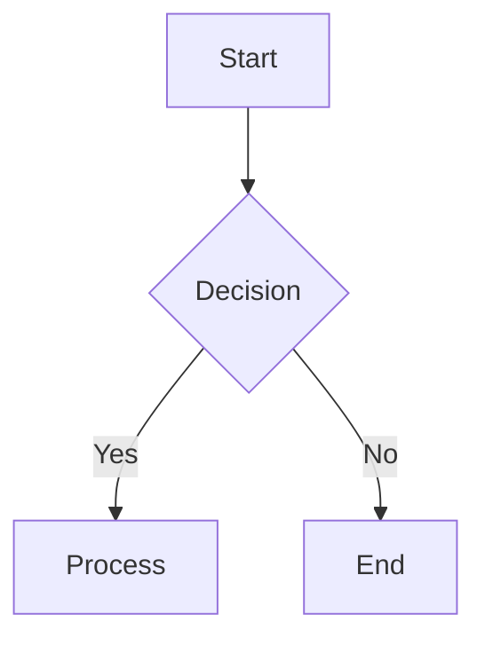

# Using the NovaSystem Documentation Structure

This guide explains how to effectively navigate and use the NovaSystem documentation structure. Understanding the organization will help you quickly find the information you need and contribute documentation effectively.

## Documentation Organization

The NovaSystem documentation is organized into a logical structure designed to separate different types of information:

```
/docs/
├── README.md                 # Main documentation index
├── architecture/             # System design and architecture
│   ├── README.md             # Architecture index
│   ├── 01-system-overview.md # System overview
│   ├── 02-component-architecture.md
│   └── ...
├── implementation/           # Implementation plans
│   ├── README.md             # Implementation index
│   ├── 01-foundation/        # Foundation phase
│   ├── 02-enhanced-functionality/
│   └── ...
├── components/               # Component specifications
│   ├── README.md             # Components index
│   ├── agents/               # Agent components
│   ├── memory/               # Memory components
│   └── ...
├── api/                      # API documentation
│   ├── README.md             # API index
│   ├── rest/                 # REST API docs
│   ├── websocket/            # WebSocket API docs
│   └── ...
├── processes/                # Process documentation
│   ├── README.md             # Processes index
│   └── ...
├── guides/                   # Development guides
│   ├── README.md             # Guides index
│   ├── getting-started/      # Getting started guides
│   ├── workflows/            # Workflow guides
│   └── ...
└── references/               # External references
    ├── README.md             # References index
    └── ...
```

## Finding the Information You Need

Use this guide to determine where to look for specific types of information:

### For New Team Members

If you're new to the project, follow this sequence:

1. Start with `/docs/README.md` for a high-level overview
2. Read `/docs/architecture/01-system-overview.md` to understand the system's purpose and design
3. Visit `/docs/guides/getting-started/` for practical setup instructions
4. Refer to `/docs/guides/workflows/development-workflow.md` to understand how to contribute

### For Implementers

If you're implementing a feature or component:

1. Start with the relevant implementation plan in `/docs/implementation/`
2. Review related component specifications in `/docs/components/`
3. Check the API documentation in `/docs/api/` if your feature exposes an API
4. Follow the development guides in `/docs/guides/features/`

### For API Integration

If you're integrating with the NovaSystem API:

1. Begin with the API overview in `/docs/api/README.md`
2. Dive into specific API documentation in `/docs/api/rest/` or `/docs/api/websocket/`
3. Review example usage in `/docs/guides/integration/`

### For Architecture Understanding

If you need to understand the system architecture:

1. Start with the system overview in `/docs/architecture/01-system-overview.md`
2. Review component architecture in `/docs/architecture/02-component-architecture.md`
3. Examine data flow in `/docs/architecture/03-data-flow-architecture.md`
4. Explore specific component details in `/docs/components/`

## Documentation Relationships

The documentation sections are interconnected:

- **Architecture Documents** define the high-level design
- **Implementation Plans** explain how to build the architecture
- **Component Specifications** detail the technical aspects of each component
- **API Documentation** describes the external interfaces
- **Process Documentation** outlines operational workflows
- **Development Guides** provide practical instructions
- **References** link to external resources

Each section cross-references related documents in other sections to help you navigate between them.

## How Documentation is Maintained

The NovaSystem documentation follows these maintenance principles:

1. **Versioned with Code** - Documentation is stored in the same repository as code
2. **Single Source of Truth** - Information exists in only one place to avoid inconsistencies
3. **Clear Ownership** - Each document has clear ownership for maintenance
4. **Regular Reviews** - Documentation is reviewed for accuracy during development cycles
5. **Automated Verification** - Links and cross-references are automatically verified

## Contributing to Documentation

To contribute to the documentation:

1. **Identify the Right Location** - Determine where your documentation belongs
2. **Create or Update Files** - Follow the existing format and templates
3. **Cross-Reference** - Add links to related documentation
4. **Update Indexes** - Add your document to relevant README.md files
5. **Request Review** - Submit your documentation for review

## Using Markdown Effectively

All documentation is written in Markdown. Follow these guidelines for consistency:

### Headings

Use proper heading hierarchy:

```markdown
# Document Title (H1) - Only one per document

## Major Section (H2)

### Subsection (H3)

#### Minor Section (H4)
```

### Code Examples

Use fenced code blocks with language specification:

```markdown
```python
def example_function():
    return "This is an example"
```
```

### Links

Use relative links for internal documentation:

```markdown
[System Overview](../architecture/01-system-overview.md)
```

### Lists

Use bullet points for unordered lists and numbers for ordered sequences:

```markdown
- Item one
- Item two
  - Sub-item
  - Sub-item

1. First step
2. Second step
   1. Sub-step
   2. Sub-step
```

### Tables

Use tables for structured data:

```markdown
| Header 1 | Header 2 |
|----------|----------|
| Cell 1   | Cell 2   |
| Cell 3   | Cell 4   |
```

### Diagrams

Use Mermaid for diagrams when possible:

```markdown

```

## Getting Help

If you're having trouble finding information or understanding the documentation:

1. Check the related README.md files for an overview
2. Look for cross-references to other documents
3. Use the project search functionality to find relevant keywords
4. Consult the documentation guidelines in `/docs/guides/documentation/`
5. Ask for help from the documentation team

## Conclusion

Effective use of the NovaSystem documentation structure will help you quickly find the information you need and contribute effectively to the project. By understanding the organization and relationships between different documentation sections, you can navigate the comprehensive documentation with ease.